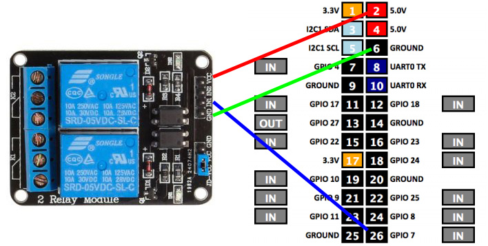

# Gpio Control Relay service
This program allows you to turn on/off a relay connected to a Raspberry Pi by a gpio port.
To configure and communicate with the service and use the relays, 
it is necessary a client program. Here is a [list of clients](#clients).

## Requirements
- Raspberry Pi or compatible
- A Gnu/Linux system installed ([LibreELEC OS](https://libreelec.tv/)
 recommended, if you want to install this in a 
different OS, please check the Gpio path in [the notes](#gpio-path))
    - Python 2.7

## Run
Just download the [ZIP](https://github.com/nearlg/script.service.relay/archive/master.zip), 
and run _/service.py_:

```bash
python service.py
```
This will be listening for new connections on the port 10000.

## Configuration
It is necessary a client to add relays and configure their gpio ports.

### Other configurations
* [Socket port](#socket-port)
* [Gpio path](#gpio-path)
* [How to connect a relay to a Raspberry PI](#connect-the-relays)

## Clients
[GCR Android client](https://github.com/nearlg/gcr-cli-android/tree/next) _(this is not a release version)_
More clients are incoming ;)

## Notes
### Socket port
Used by the socket for the communication with the app.</br>
*By default: 10000*
You can change it from _SOCKET_PORT_ in _/service.py_

### GPIO path
It depends on the system, it has the LibreELEC path by default.</br>
*By default: /sys/class/gpio*
You can change it from _GPIO_DIRECTORY_NAME_ in _/lib/repository/gpio.py_

### Connect the relays
This is an example about how to connect a relay to a Raspberry Pi.



In this example the relay is connected on port Gpio 7.
Now, from the client application, it is necessary to configure (only once, the first time), a relay connected on port _7_.
